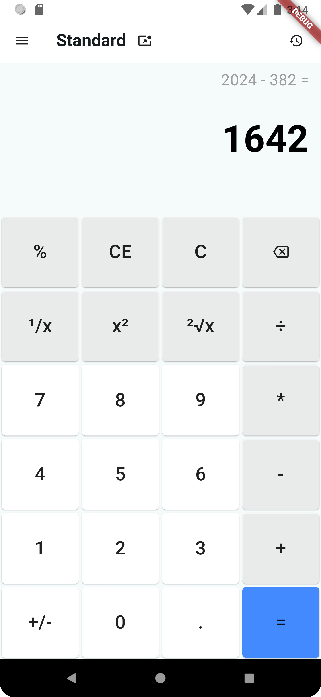

<h1 align="center">  🧮  Flutter Calculator </h1>

Simple calculator app built with Flutter.

## ✅ Features

- [x] Beautiful and intuitive user interface
- [x] Basic arithmetic operations: addition, subtraction, multiplication, division
- [x] Advanced operations: square root, inverse
- [x] Clear Entry (CE) button functionality
- [x] Clear (C) button functionality
- [x] Decimal point support
- [ ] Error handling for division by zero
- [ ] Keyboard input support
- [ ] History of previous calculations
- [ ] Parentheses support for complex calculations
- [ ] Scientific operations (exponential, logarithmic, trigonometric functions)
  
## :mag: Preview

This app is designed to provide a simple and intuitive interface for all your calculation needs. The screenshot below gives you a glimpse of the app's user-friendly design and functionality.

📸 App screenshot

## :rocket: Getting Started

These instructions will get you a copy of the project up and running on your local machine for development and testing purposes.

### :clipboard: Prerequisites

- Flutter SDK (version that supports Dart SDK '>=3.3.4 <4.0.0')
- Dart SDK (version '>=3.3.4 <4.0.0')
- An IDE like VS Code or Android Studio

### :wrench: Installation

1. Clone the repo `git clone https://github.com/sikatikenmogne/flutter_calculator.git`
2. Navigate to the project directory `cd flutter_calculator`
3. Install dependencies `flutter pub get`
4. Run the app `flutter run`

## :bulb: Usage

Open the app, and you'll see a standard calculator interface. You can perform basic arithmetic operations, as well as some advanced operations.

## :handshake: Contributing

Contributions are what make the open-source community such an amazing place to learn, inspire, and create. Any contributions you make are greatly appreciated.

   1. Fork the Project
   2. Create your Feature Branch (`git checkout -b feature/AmazingFeature`)
   3. Commit your Changes (`git commit -m 'Add some AmazingFeature'`)
   4. Push to the Branch (`git push origin feature/AmazingFeature`)
   5. Open a Pull Request

## :page_with_curl: License

Distributed under the MIT License. See [LICENSE](LICENSE) for more information.

## :email: Contact

